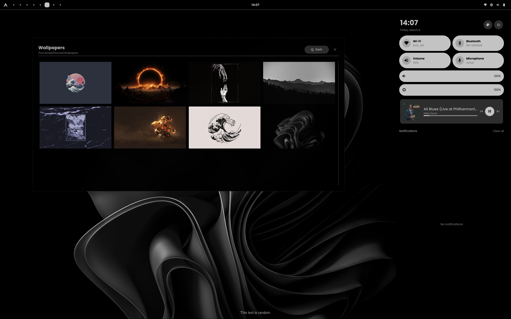

# Monoland
A Monochromatic themed Hyprland rice with Quickshell widgets.

>[!WARNING]
>For the sake of transparency, Quickshell code is written largely by Claude 4.6 Sonnet + 4.6 Opus via OpenCode. 
>This is due to the fact that I am not proficient enough with Quickshell _yet_ to write it independently.
>While I have tried to keep it clean, modular and de-bloated, I have not had a chance 
>to read the code in great detail. Nonetheless, I hope they will be helpful to you.
>I will remove this WARNING admonition block when I am done reviewing + re-writing quickshell parts manually.

# Setup
There is no installation script, however the setup should be pretty straightforward. You'll need to install `quickshell-git` 
from AUR, `grimblast`, `brightnessctl`, `pipewire`, `hyprpaper`, `python-pywal` before you proceed. 

1. Create a directory in `.local/share/monoland` and copy one of the Wallpapers into there under name `current`.
2. Move `Wallpapers/` into `~/Pictures/`
3.Install `JetBrains`, `Poppins` fonts into your system.
4. Place `kitty/`, `quickshell/`, `hypr/` under `~/.config/`
5. Try to run `quickshell` or `qs` (and pray for success)

# Showcase

