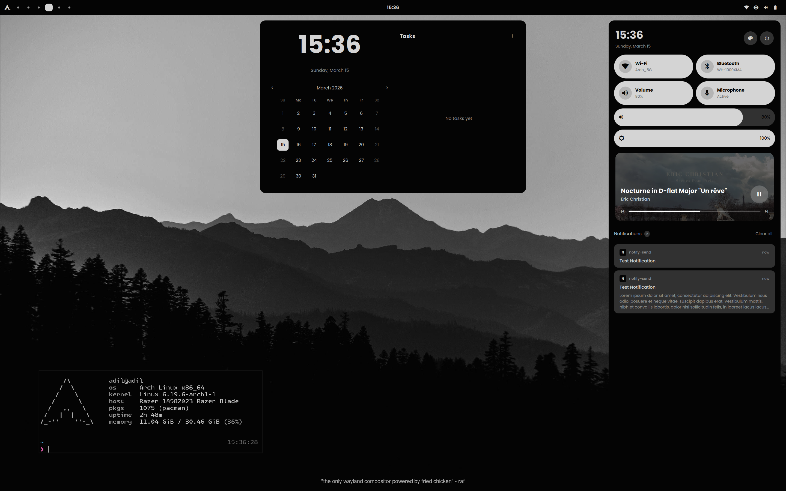
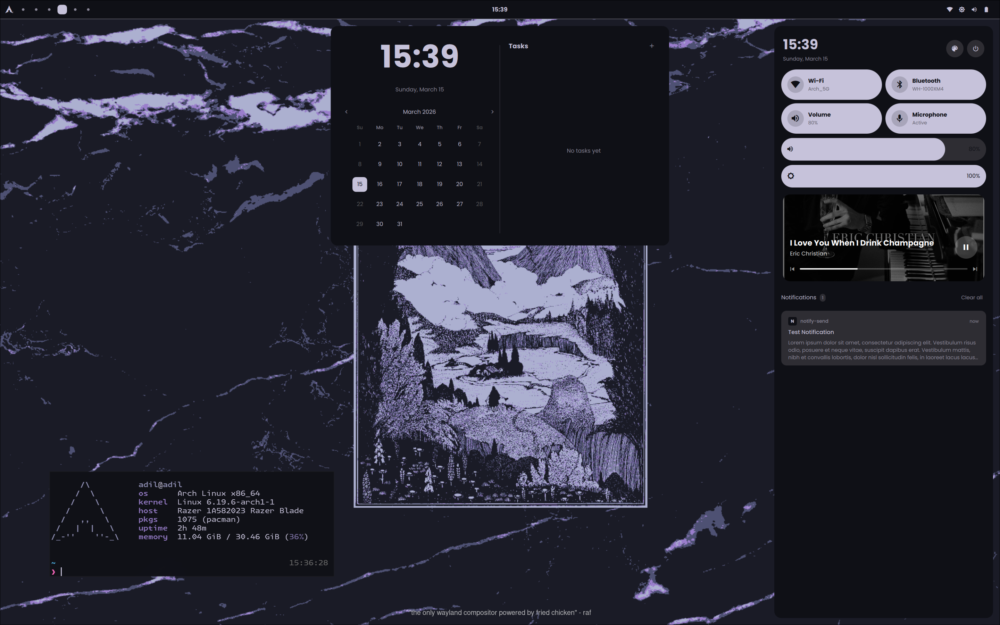
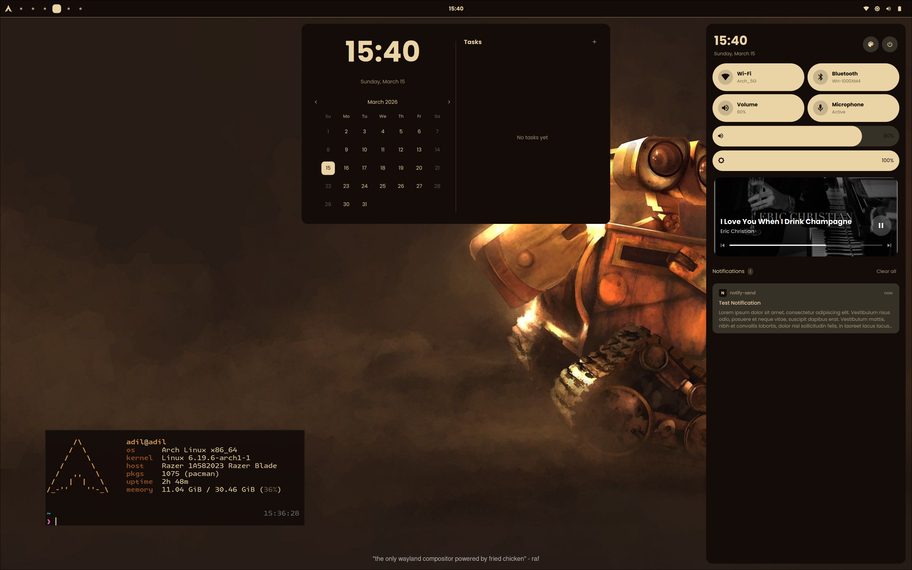
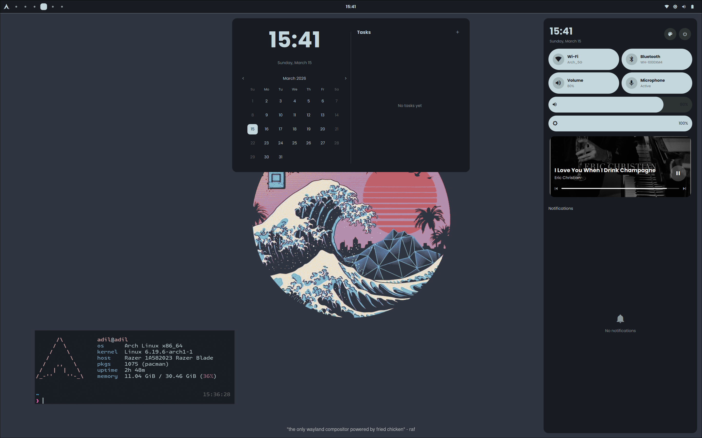

# Monoland
A Monochromatic themed Hyprland rice with Quickshell widgets.

>[!WARNING]
>For the sake of transparency, Quickshell code is written largely by Claude 4.6 Sonnet + 4.6 Opus via OpenCode. 
>This is due to the fact that I am not proficient enough with Quickshell _yet_ to write it independently.
>While I have tried to keep it clean, modular and de-bloated, I have not had a chance 
>to read the code in great detail. Nonetheless, I hope they will be helpful to you.
>I will remove this WARNING block when I am done reviewing + re-writing quickshell parts manually.

# Auto-Setup
Make sure you have an AUR helper installed and run:

```sh 
./install.sh
```

the script *will* install `paru` if you don't have any helpers installed on your system, but it's safer to have a helper pre-installed.

# Manual Setup
If you prefer a manual setup (or the script has failed you) no worries, it should be pretty straightforward. You'll need to install `quickshell-git` and `grimblast-git`
from AUR, and `swappy`, `brightnessctl`, `pipewire`, `hyprpaper`, `python-pywal` from official DBs before you proceed. 

1. Create a directory in `.local/share/monoland` and copy one of the Wallpapers into there under name `current`.
2. Move `Wallpapers/` into `~/Pictures/`
3. Install `JetBrains`, `Poppins` fonts into your system.
4. Place `kitty/`, `quickshell/`, `hypr/` under `~/.config/`
5. Try to run `quickshell` or `qs` (and pray for success)

>[!TIP]
>Optionally, configure Hyprland as per your requirements, I'm left-handed so my keybinds might not be 
>best suited for everyone.

# Showcase








# Known Issues
- [ ] Theme/Wallpaper switch can be slow
- [ ] Brightness Control is hard-coded, will not work out-of-the-box
- [ ] Battery indicator _might_ not work on your system
